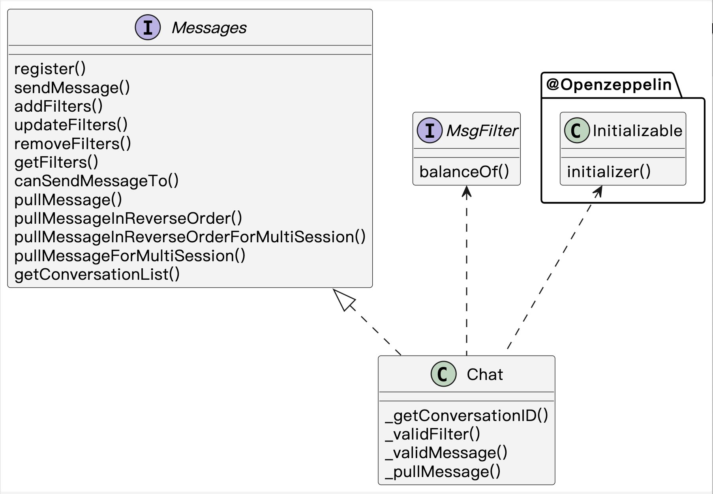
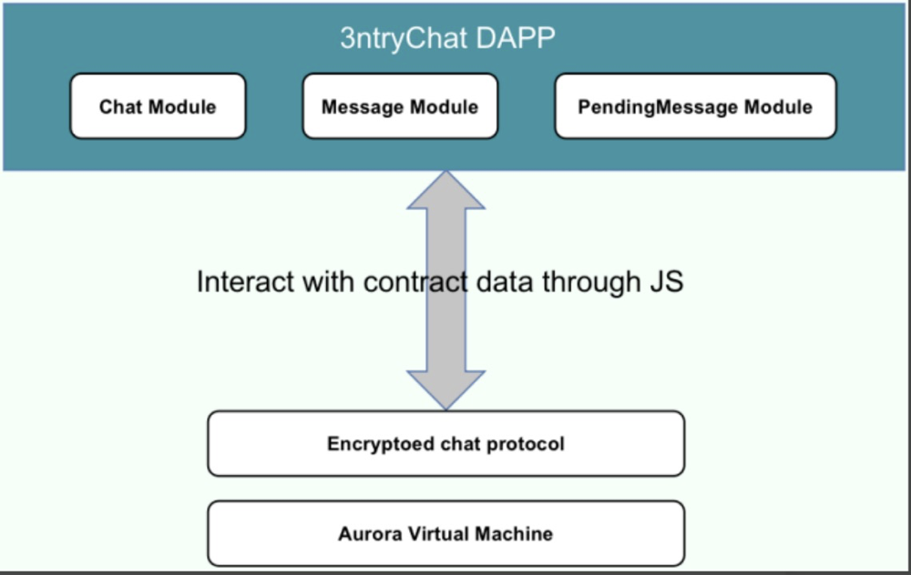

# ENCRYPTED CHAT

## 1.Getting Started

### 1.1 Installation
```
$ npm install 
```
or
```
$ yarn
```
install all dependencies we need.

### 1.2 Set ENV

rename .env.sample to .env, and set the value below.
```
SIGNER_PRIVATE_KEY="YOUR ACCOUNT PRIVATE KEY"
NETWORK_URL="NETWORK URL"
MAX_AMOUNT=10
```

add the network you need in hardhat.config.js file like below:
```
networks: {
        NETWORK_NAME: {
            url: `${NetworkUrl}`,
            accounts: [`0x${SignerPrivateKey}`]
        }
    }
```

### 1.3 Test

Run all tests
```
hardhat test
```

### 1.4 Deploying
Deploy your contract on specific network
```
npx hardhat run ./deployment/deploy-chainchat.js --network NETWORK_NAME
```
Response is:
```
complete, contract deployed, address: CONTRACT_INSTANCE_ADDRESS
```


## 2. Contract Introduction

### 2.1 Architecture


### 2.2 Overview
Encrypted chat protocol allows people to communicate with others without central server, all message are stored on the chain and only the communicating parties can parse the messages.

#### 2.2.1 IMessage.sol
defined the main structure about message content and filter, and methods which need to be implemented.

#### 2.2.2 ISBTFilter.sol
define the method which need to implemented in specific filter, like ERC20 or ERC721 etc.

#### 2.2.3 chat.sol
the contract that implement IMessage, define the handler logic for message processing and is responsible for interacting with user.

#### 2.2.4 Metadata


| contract |  network | address
|------ | ------ | -----
| chat | Aurora | 0x926F2AEAaae27006cb5a663B6E6FD28c9E3F186C

## 3.Main Functions Introduction

### 3.1 chat
#### 1、 function register(PubKeyPoint calldata pk) external
Explanation: Users register public key on chain, can be update by user.The pk will be used for message encryption.

#### 2、function sendMessage(address receiver, PubKeyPoint calldata pk, bytes calldata message) external
Explanation: Users send message to receiver with user's public key.We do not care about the content of message, it will be encrypted by public key of party of communication.

#### 3、function addFilters(SBTFilter[] calldata addFiltersInfo) external
Explanation: Users add filters to restrict calls from people they are not interested in.The filter declares the associated contract address and asset amount.

#### 4、function updateFilters(SBTFilter[] calldata updateFiltersInfo) external
Explanation: Users update filters to change the limit of asset amount.

#### 5、function removeFilters(address[] calldata delFiltersInfo) external
Explanation: Users remove filters which they do not need anymore.

#### 6、function getFilters(address user) external view returns(SBTFilter[] memory)
Explanation: Get filters by user's address.

#### 7、function getConversationList(address user, uint256 start, uint256 count) external view returns(ConversationInfo[] memory, uint256, bool)
Explanation: Get conversation list by user's address, start means the index of begin, count means the amount of conversation.

#### 8、function pullMessageInReverseOrderForMultiSession(address peer1, address[] calldata peer2,uint256[] calldata end, uint256[] calldata count) external view returns (RetrievalMessageInfo[][] memory result)
Explanation: Obtain the message list of both parties in reverse order in a batch.

#### 9、function pullMessageInReverseOrder(address peer1, address peer2,uint256 end, uint256 count) external view returns (RetrievalMessageInfo[] memory)
Explanation: Obtain the message list of both parties in reverse order.

#### 10、function pullMessageForMultiSession(address peer1, address[] calldata peer2,uint256[] calldata begin, uint256[] calldata count) external view returns (RetrievalMessageInfo[][] memory result)
Explanation: Obtain the message list of both parties in a batch.

#### 11、function pullMessage(address peer1, address peer2,uint256 begin, uint256 count) external view returns (RetrievalMessageInfo[] memory)
Explanation: Obtain the message list of both parties.

#### 12、function canSendMessageTo(address sender, address receiver) external view returns (bool)
Explanation: Query whether the sender can send messages to the receiver.


## 4. 3ntryChat APP

### 4.1 APK File Installation Guide
1. Download the APK file
2. Locate the file in file manager
3. Install and launch the application on your home screen

### 4.2 Application Features
#### 4.2.1 Chat Message Encryption
Generates an encryption string using the public key of the contact's wallet and the private key of the user's wallet.

Uses the generated string as a key to encrypt chat content via AES encryption.

#### 4.2.2 Cross-terminal Access to Chat History
The same account can retrieve chat history on different devices by fetching on-chain data.

### 4.3 Architecture



ChatModule: Forms a chat when sending a message to a contact and receives the latest messages/new chats. 

MessageModule: Receives, sends, and stores messages. 

PendingMessageModule: Sends pending messages to the blockchain.